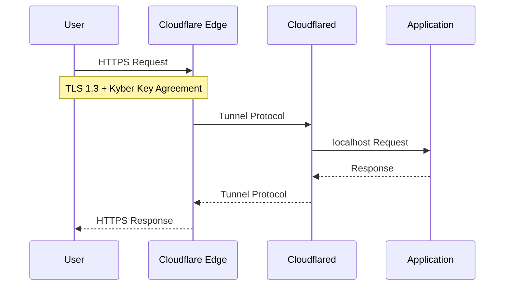

# Post-Quantum VPN Router - Cloudflare Tunnel

<p align="center">
  <strong>Open Source Post-Quantum Ingress with Cloudflare Tunnel</strong>
</p>

<p align="center">
  
  
  
</p>

---

## Overview

Open source implementation focusing on **post-quantum security for Cloudflare Tunnel**, using TLS 1.3 with Kyber key agreement at the edge.

**Easiest to deploy** - leverages Cloudflare's built-in PQC support.

### How It Works



## Quick Start

```bash
git clone https://github.com/vinzabe/post-quantum-vpn-cloudflare-tunnel.git
cd post-quantum-vpn-cloudflare-tunnel
./scripts/setup.sh
docker compose up -d
```

## Cloudflare PQC Configuration

Cloudflare automatically negotiates post-quantum key agreement when supported:

```yaml
# cloudflared config
tunnel: your-tunnel-id
credentials-file: /etc/cloudflared/credentials.json

# PQC is enabled by default in modern cloudflared
post-quantum: true
```

## Verify PQC is Active

```bash
# Check cloudflared logs
docker logs cloudflare-tunnel 2>&1 | grep -i "post-quantum"

# Or check Cloudflare dashboard for PQC indicator
```

## License

MIT License - See LICENSE file.

## Enterprise Support

**Email:** grant@abejar.net

---

Developed by Abejar | Open Source Edition
